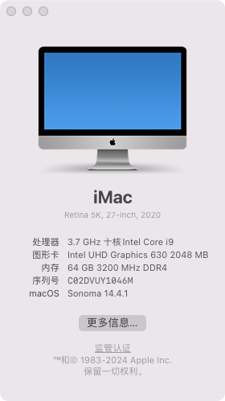

# SoarSea P310s Hackintosh

## 电脑配置

|   规格   |                           详细信息                           |
| :------: | :----------------------------------------------------------: |
| 电脑型号 |                        SoarSea P310s                         |
| 电脑型号 |                       TinyMonster Pro                        |
| 操作系统 |     macOS `Sonoma`  /`Ventura` / `Monterey` / `Big Sur`      |
|  处理器  |                 英特尔 酷睿 i9-10900K 10C20T                 |
|   内存   |                        64 GB 2933MHz                         |
|  硬盘1   |               Nvme Only: `WD_BLACK SN750 2TB`                |
| 硬盘2/3  |               可接两块SATA 2.5寸硬盘/SATA SSD                |
|   显卡   |       Intel UHD Graphics 630/可插独立显卡/独显独立供电       |
|  显示器  |                 支持`3840x2160 4K@60Hz`双显                  |
|   声卡   |                  Realtek ALC269 `alcid=33`                   |
|   网卡   | m.2 NGFF插槽，已更换为[BCM94360Z3]([首页-黑果小兵的部落阁-淘宝网 (taobao.com)](https://hackintosher.taobao.com/)) |

## 注意事项

[OCLP教程](https://blog.daliansky.net/OCLP.html)

需要 10代 CPU 和  BCM94360 系列网卡, 如果不对可能会出现问题. 

使用打**补丁方式 Sonoma 后续每次OTA更新都是全量(13GB左右) 每次更新完需要重新打补丁**, 

大概率 Sonoma 是最后一版 完美黑果 且用且珍惜吧

本项目根据大佬教程和原项目更新, 启动命令可能有冗余内容 目前使用未发现任何异常

+ 本项目EFI已经做好**USB定制**  
+ 替换EFI升级 Mac Sonoma 后 wifi 可以打开 **搜索不到wifi 是正常情况,  使用OCLP 打好补丁可以恢复正常**.
+ 目前本人使用 **连接手机热点 需要 iPhone 打开 最大兼容性设置才能正常使用手机热点**  双向隔空可以正常使用

## 使用步骤

**提前下载好 `OpenCore Legacy Patcher` 工具 安装好**

1 **备份好本机原本的EFI文件 如果有问题可以及时恢复**

2 下载项目中的EFI 替换本机, 清空一下 nvram 重启后测试是否功能正常. **不正常的话换回原本EFI 停止升级**.

3  正常的话, 设置- 全量更新到 Sonoma 正式版, ( **目前最新EFI 14.3 和 14.3.1正式版均正常使用** ) 测试版系统未经过测试 请勿尝试.

4 按照教程中使用 `OpenCore Legacy Patcher` 工具直接打好补丁重启就可以正常使用了 **如果遇到卡开机的可以按教程卸载后重复打补丁**

后续如果进行 OTA 升级, 同样需要升级后重新打补丁后才能正常使用 WIFI

## 更新日志
- 19-2-2024
  - Release `v2.0.2`
  - 更新 OpenCore开发版 `v0.9.9`
- 6-2-2024
  - Release `v2.0.1`
  - 更新 OpenCore开发版 `v0.9.8`
  - 更新主题图标
- 5-2-2024
  - Release `v2.0.0`
  - 更新 OpenCore `v0.9.7`
  - 支持 Sonoma 安装使用，[OCLP教程](https://blog.daliansky.net/OCLP.html)
- 3-21-2023
  - Release `v1.6.0`
  - OpenCore `v0.9.0`
  - 支持 `Ventura` `13.3+`
- 11-2-2022
  - Release `v1.5.0`
  - OpenCore `v0.8.5`
  - 支持 `Ventura`
- 9-26-2022
  - Release `v1.3.0`
  - OpenCore `v0.8.4`
  - 适配 `Dock` 新机型
- 10-25-2021
  - Release `v1.2.0`
  - OpenCore `v0.7.5`
  - 修复声卡问题
  - 支持`Monterey`安装使用
- 9-17-2021
  - Release `v1.1.0`
  - OpenCore `v0.7.3`
  - 修复双屏花屏问题
- 7-28-2021
  - Release `v1.0.0`
  - OpenCore `v0.7.1`

## 截屏

 
