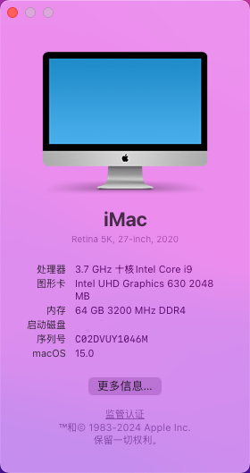

# SoarSea P310s Hackintosh

## 因本人已更换设备为 mac mini

## 本项目自 2024 11.15 起正式归档 停止维护 不再更新

## 电脑配置

|   规格   |                           详细信息                           |
| :------: | :----------------------------------------------------------: |
| 电脑型号 |               SoarSea P310s / TinyMonster Pro                |
| 操作系统 | macOS  `Sequoia` / `Sonoma`  /`Ventura` / `Monterey` / `Big Sur` |
|  处理器  |                 英特尔 酷睿 i9-10900K 10C20T                 |
|   内存   |                        64 GB 3200MHz                         |
|  硬盘1   |               Nvme Only: `WD_BLACK SN750 2TB`                |
| 硬盘2/3  |               可接两块SATA 2.5寸硬盘/SATA SSD                |
|   显卡   |       Intel UHD Graphics 630/可插独立显卡/独显独立供电       |
|  显示器  |                 支持`3840x2160 4K@60Hz`双显                  |
|   声卡   |                  Realtek ALC269 `alcid=33`                   |
|   网卡   | **支持BCM94360NG/Z3/Z4**  已更换为[BCM94360Z3]([首页-黑果小兵的部落阁-淘宝网 (taobao.com)](https://hackintosher.taobao.com/)) |

## Sequoia 部分

目前已经测试 Sequoia Developer Beta 版本, 如需尝鲜请仔细阅读

我自己是选择 Sequoia 15.1 Developer Beta 然后更新上来的  现在切换到了 Sequoia Developer Beta 6

### mac Sequoia 目前测试过的可用版本

| 版本(测试版)                                      | 注意事项           |
| ------------------------------------------------- | ------------------ |
| 15.0 (更新设置中选择 Sequoia 15.1 Developer Beta) | **使用 OCLP 16.0** |
| 15.0  b6 (更新设置中选择 Sequoia Developer Beta)  | **使用 OCLP 16.0** |

### 目前存在已知问题

+ **Sequoia新功能 手机镜像** 无法使用 (黑苹果可能都无法使用 看后续更新 **因缺少T2安全芯片**)

### 注意事项

照着兵哥的最新更新项目抄了下作业, 更新了kext修改了启动参数 目前自己测试隔空接力均正常

版本 15.0 B6  **如果隔空异常 请先检查 隔空投送是否打开**

[OCLP教程](https://blog.daliansky.net/OCLP.html) 

需要使用 OCLP 16.0 目前正式版未发布 进入页面后选择最新构建版本下载 升级步骤与 Sonoma 一样

[OCLP测试版 下载地址](https://github.com/dortania/OpenCore-Legacy-Patcher/actions/workflows/build-app-wxpython.yml)

## Sonoma 部分

### 注意事项

[OCLP教程](https://blog.daliansky.net/OCLP.html) 	

[OCLP最新版下载链接](https://github.com/dortania/OpenCore-Legacy-Patcher/releases)

需要 10代 CPU 和  **BCM94360NG/Z3/Z4** 系列网卡, 如果不对可能会出现问题.  大概率 Sonoma 是最后一版 完美黑果 且用且珍惜吧

### mac Sonoma 目前测试过的可用版本

| 版本(正式版) | 注意事项                                                     |
| ------------ | ------------------------------------------------------------ |
| 14.5         | 使用最新版OCLP                                               |
| 14.4.1       | 使用最新版OCLP                                               |
| **14.4**     | **使用最新版OCLP 最新版 EFI** 如果已经遇到wifi打不开 替换EFI 最新OCLP打补丁 |
| 14.3.1       | 需要OCLP打补丁                                               |
| 14.3         | 需要OCLP打补丁                                               |

使用打**补丁方式 Sonoma 后续每次OTA更新都是全量(13GB左右) 每次更新完需要重新打补丁 如最新正式版不在可用版本列表内, 切勿随意乱升级.** 

本项目根据大佬教程和原项目更新, 启动命令可能有冗余内容 目前使用未发现任何异常

+ **14.4 升级后如果 wifi 打不开** 替换项目最新EFI 下载最新版本 OCLP 打补丁后即可恢复正常 
+ 本项目EFI已经做好**USB定制**  
+ 替换EFI升级 Mac Sonoma 后 wifi 可以打开 **搜索不到wifi 是正常情况,  使用OCLP 打好补丁可以恢复正常**.
+ 目前本人使用 **连接手机热点 需要 iPhone 打开 最大兼容性设置才能正常使用手机热点**  双向隔空可以正常使用

## 使用步骤

**提前下载好 `OpenCore Legacy Patcher` 工具 安装好**

1 **备份好本机原本的EFI文件 如果有问题可以及时恢复**

2 下载项目中的EFI 替换本机, 清空一下 nvram 重启后测试是否功能正常. **不正常的话换回原本EFI 停止升级**.

3  正常的话, 设置- 全量更新到 Sonoma 正式版, ( **目前最新EFI 14.3, 14.3.1, 14.4, 14.4.1, 14.5正式版均正常使用** ) 测试版系统未经过测试 请勿尝试.

4 按照教程中使用 `OpenCore Legacy Patcher` 工具直接打好补丁重启就可以正常使用了 **如果遇到卡开机的可以按教程卸载后重复打补丁**

后续如果进行 OTA 升级, 同样需要升级后重新打补丁后才能正常使用 WIFI

## 更新日志

- 8-13-2024
  - Release `v2.0.4`
  - 更新 OpenCore开发版 `v1.0.1` 
  - 支持 `Sequoia 15.0`
- 12-3-2024
  - Release `v2.0.3`
  - 更新 OpenCore开发版 `v0.9.9`
  - 更新 `IOSkywalkFamily.kext` 到 `v1.1.0` 
  - 支持 `Sonoma 14.4`
- 19-2-2024
  - Release `v2.0.2`
  - 更新 OpenCore开发版 `v0.9.9`
- 6-2-2024
  - Release `v2.0.1`
  - 更新 OpenCore开发版 `v0.9.8`
  - 更新主题图标
- 5-2-2024
  - Release `v2.0.0`
  - 更新 OpenCore `v0.9.7`
  - 支持 Sonoma 安装使用，[OCLP教程](https://blog.daliansky.net/OCLP.html)
- 3-21-2023
  - Release `v1.6.0`
  - OpenCore `v0.9.0`
  - 支持 `Ventura` `13.3+`
- 11-2-2022
  - Release `v1.5.0`
  - OpenCore `v0.8.5`
  - 支持 `Ventura`
- 9-26-2022
  - Release `v1.3.0`
  - OpenCore `v0.8.4`
  - 适配 `Dock` 新机型
- 10-25-2021
  - Release `v1.2.0`
  - OpenCore `v0.7.5`
  - 修复声卡问题
  - 支持`Monterey`安装使用
- 9-17-2021
  - Release `v1.1.0`
  - OpenCore `v0.7.3`
  - 修复双屏花屏问题
- 7-28-2021
  - Release `v1.0.0`
  - OpenCore `v0.7.1`

## 截屏

 
